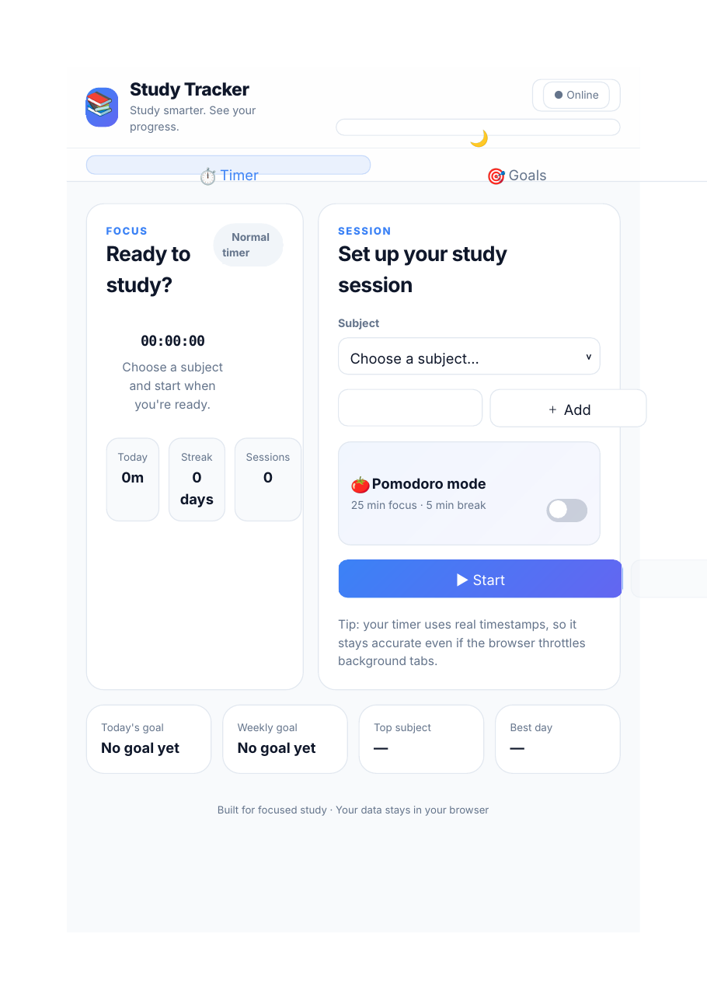
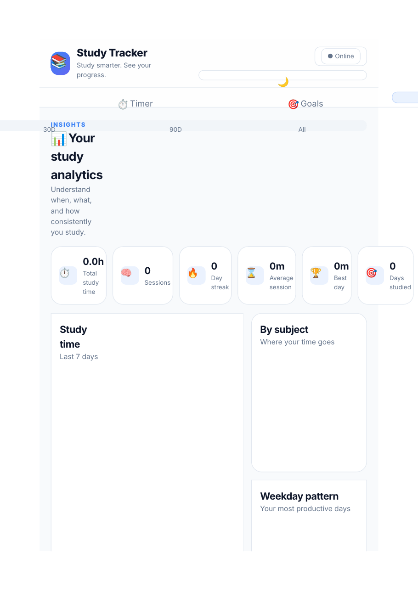

# 📚 Study Tracker

> A polished, offline-first study timer and productivity dashboard built for students who want to track focused study time, build consistency, and understand their habits.

<p align="center">
  <a href="https://fahimmahmudekram.github.io/Study-Tracker/">
    <strong>🚀 Live Demo</strong>
  </a>
</p>

<p align="center">
  
  
</p>

## ✨ Overview

Study Tracker is a client-side study productivity app that combines an accurate study timer, Pomodoro sessions, goal tracking, analytics, achievements, and a GitHub Pages-ready Progressive Web App (PWA) experience.

The project is designed around a simple idea: **make focused study measurable without requiring an account or a backend database.** Your study data is stored locally in the browser, with JSON export/import available for backups and portability.

## 🚀 Live Demo

**[Open Study Tracker](https://fahimmahmudekram.github.io/Study-Tracker/)**

The app is deployed with **GitHub Pages** and can be installed as a PWA on supported browsers.

## 🎯 Features

### ⏱️ Accurate Study Timer
- Timestamp-based timing for reliable elapsed-time tracking.
- Remains accurate when browser tabs are throttled or temporarily inactive.
- Tracks today's study time, streak, and completed sessions.
- Subject selection and custom subject creation.

### 🍅 Pomodoro Mode
- Configurable focus and break durations.
- Pause/resume controls.
- Automatic completion logging for finished Pomodoro sessions.
- Break notifications and session-state handling.

### 🎯 Goal Tracking
- Daily, weekly, and monthly study targets.
- Live progress indicators.
- Quick summaries on the main timer screen.

### 📊 Analytics Dashboard
- 7-day, 30-day, 90-day, and all-time views.
- Total study time and session count.
- Current streak and average session length.
- Best study day and number of days studied.
- Study-time trends, subject breakdown, and weekday patterns.
- 53-week study activity heatmap.

### 🏆 Achievements
- Built-in milestone achievements.
- Progress tracking toward each milestone.
- Custom achievements with user-defined targets.

### 💾 Data Portability
- Export study data as a portable JSON backup.
- Import backups later to restore sessions, goals, achievements, and settings.
- No account required.

### 📱 Progressive Web App
- Installable on supported browsers.
- Standalone app experience.
- Web App Manifest included.
- Service-worker caching for offline launches after the first HTTPS visit.
- Responsive layout for desktop and mobile screens.

### 🌙 Personalization
- Light and dark themes.
- Locally saved preferences.
- Configurable sound effects and Pomodoro timing.

## 🛠️ Tech Stack

| Technology | Purpose |
| --- | --- |
| **HTML5** | Application structure and accessible UI markup |
| **CSS3** | Responsive layout, cards, controls, themes, and visual styling |
| **Vanilla JavaScript** | Timer logic, analytics, goals, achievements, storage, and interactions |
| **Web Storage API** | Local persistence of sessions, goals, settings, and achievements |
| **Service Worker API** | Offline app-shell caching |
| **Web App Manifest** | PWA metadata and installability |
| **GitHub Pages** | Static hosting and deployment |

## 📁 Project Structure

```text
Study-Tracker/
├── index.html
├── study-tracker.css
├── study-tracker.js
├── manifest.json
├── service-worker.js
├── favicon.svg
├── icon-192.png
├── icon-512.png
├── screenshots/
│   ├── dashboard.png
│   └── analytics.png
├── README.md
└── LICENSE
```

## ▶️ Run Locally

The app has no build step and no package manager dependency.

For a quick local preview, serve the project directory with any static HTTP server. For example:

```bash
python3 -m http.server 8000
```

Then open:

```text
http://localhost:8000
```

Serving the app over HTTP(S) is recommended for testing PWA features such as service workers and installation.

## 💾 Data & Privacy

Study Tracker is designed as a local-first application:

- Study sessions, goals, achievements, subjects, preferences, and timer state are stored in the browser's local storage.
- There is no required user account.
- There is no server-side study database required by the app.
- Use **Settings → Export JSON** to make a backup before clearing browser data or moving to another device.

## 🧠 Design Principles

**Local-first** — your study history stays on your device by default.

**Accurate timing** — elapsed time is calculated from timestamps instead of relying only on repeated UI ticks.

**Actionable analytics** — the dashboard focuses on consistency, trends, subjects, and study habits rather than raw numbers alone.

**Minimal setup** — the project is plain HTML, CSS, and JavaScript with no build pipeline required.

## 🗺️ Roadmap

Potential future improvements:

- Calendar-based session drill-down.
- More detailed weekly and monthly reports.
- Optional cloud synchronization.
- Keyboard shortcuts.
- More achievement types and milestone rules.
- Additional export formats.

## 👨‍💻 Author

**Fahim Mahmud**

- GitHub: [@FahimMahmudEkram](https://github.com/FahimMahmudEkram)
- LinkedIn: [Fahim Mahmud](https://www.linkedin.com/in/fahim--mahmud/)
- Live Project: [Study Tracker](https://fahimmahmudekram.github.io/Study-Tracker/)

## 📄 License

This project is open source and available under the [MIT License](LICENSE).
